# Toy MABM 

Se construyó un MABM basado en los trabajos de Caiani et al.( 2016), Assenza et al.(2015) y Dawid y Delli Gatti(2018).

### Ejecución de programa

El programa principal recibe los parámetros del archivo ```parametros_toy_model.yaml```. Para correr la simulaciones, ejecutamos el siguiente comando:

```
python  main_toy_model.py
```

El programa guarda los resultados principales en archivos csv dentro del directorio ```/data```. Con estos csv generamos las gráficas resumen con el siguiente script:

```
Rscript output_plots.R 
```

### Resultados

Para una corrida de 50 simulaciones, 300 periodos para productividades laborales de 0.4, 0.6,0.8 y 1 , tenemos los siguientes resultados:

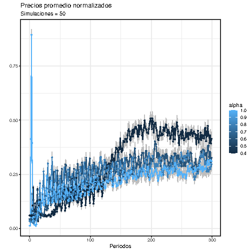 
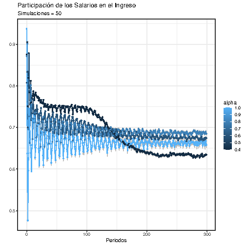 
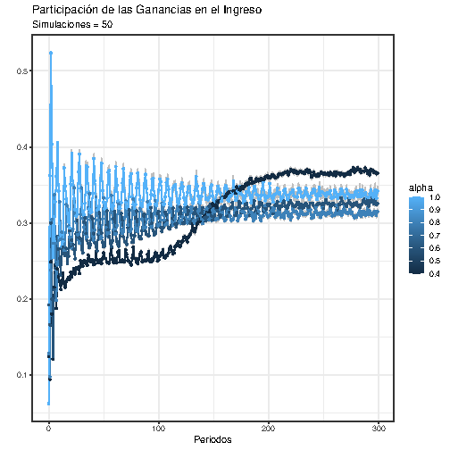
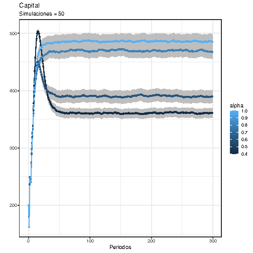
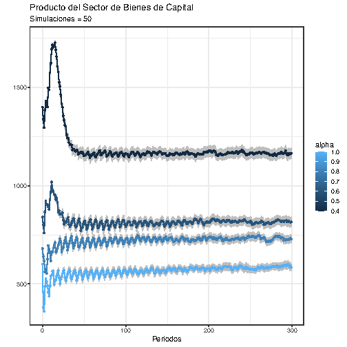
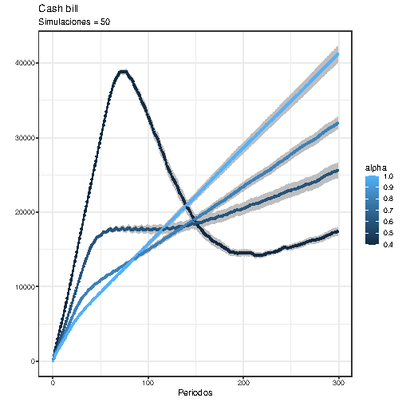
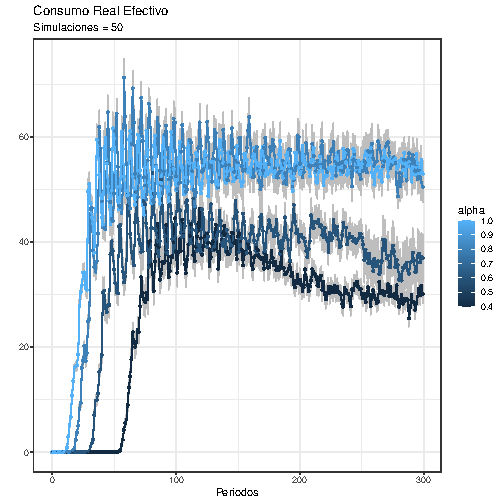
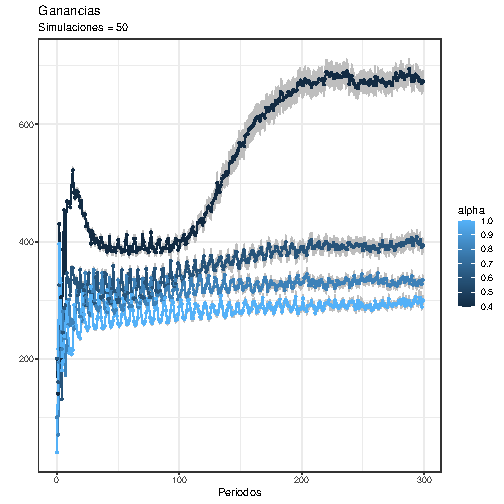
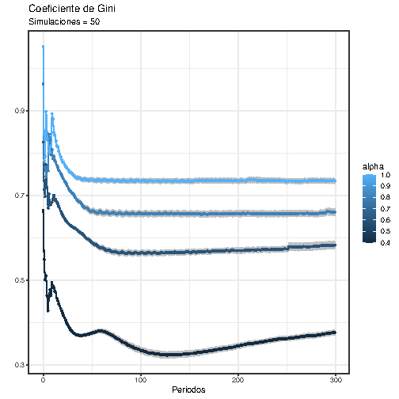
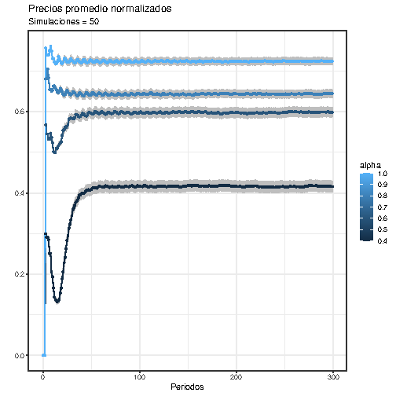
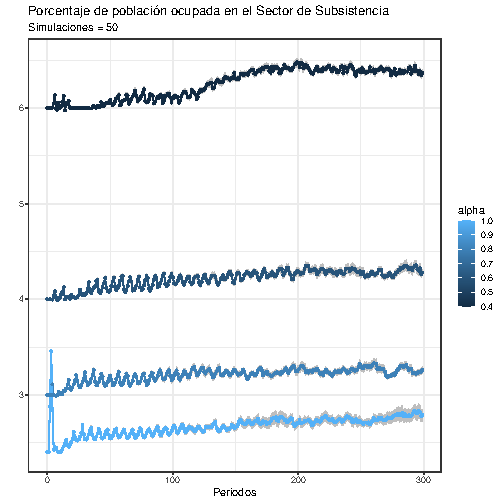
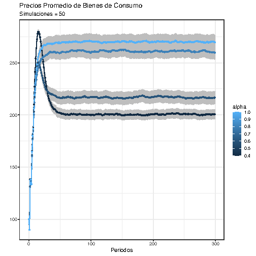
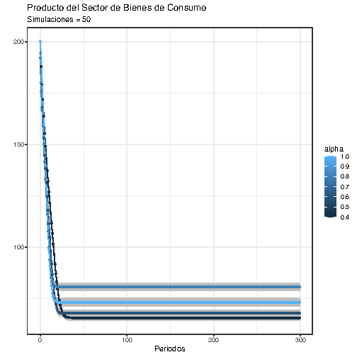
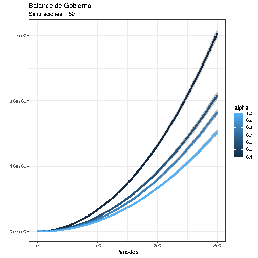
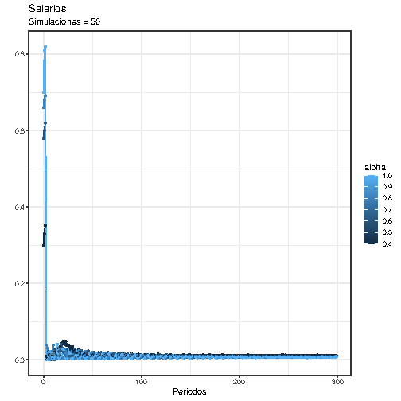
